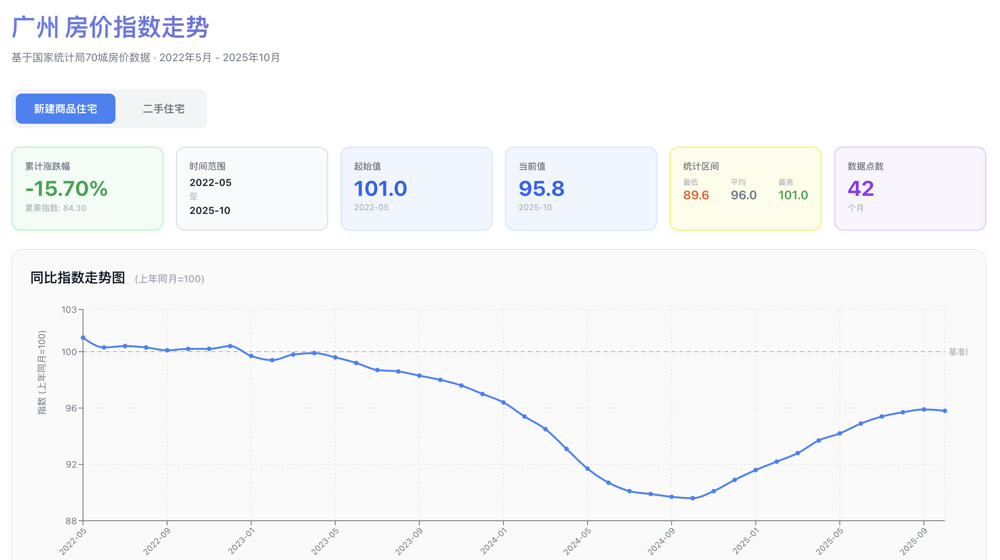

# MyPoorHouse

> 算一算我的房子到底亏了多少 💸

基于国家统计局70城房价数据的可视化工具，用于分析个人房产投资的真实收益情况。



## 数据来源

- **官方数据源**: [国家统计局 - 70个大中城市商品住宅销售价格变动情况](https://www.stats.gov.cn/)
- **时间范围**: 2022年5月 - 2025年10月（42个月）
- **数据类型**: 新建商品住宅 & 二手住宅价格指数（环比、同比）

**声明**: 本项目仅供个人学习和参考使用，数据来源于公开渠道。

## 功能特性

- ✅ 自动爬取和提取国家统计局70城房价数据
- 📊 交互式折线图展示房价指数走势
- 📉 **累计涨跌幅**计算（基于环比指数累乘）
- 🔄 切换新房/二手房数据视图
- 📱 现代化响应式UI设计

## 快速开始

```bash
# 安装依赖
npm install

# 启动开发服务器
npm run dev
```

访问 http://localhost:3000

## 项目结构

```
├── data/
│   ├── dataSource.json     # URL索引（42个月）
│   ├── raw/                # 原始HTML（69MB）
│   └── extracted/          # 提取的JSON数据
├── scripts/
│   ├── download-html.js    # 下载脚本
│   ├── extract-data.js     # 数据提取
│   └── verify-extraction.js # 数据验证
└── src/                    # React应用
    ├── components/         # UI组件
    ├── store/             # Redux状态管理
    └── utils/             # 数据工具
```

## 技术栈

**数据层**: Node.js + Cheerio（HTML解析）
**前端**: React + Redux Toolkit + Recharts + Vite

## 累计涨跌幅计算说明

使用**环比(MoM)累乘**计算整体涨跌：

```
累计指数 = 100 × (第1月MoM/100) × (第2月MoM/100) × ... × (第N月MoM/100)
累计涨跌幅 = 累计指数 - 100
```

> 例：若连续2个月环比分别为99.5和99.0，则累计指数 = 100 × 0.995 × 0.99 = 98.505，跌幅1.495%

详细计算过程见浏览器控制台日志。

## 更新数据

```bash
# 1. 下载最新HTML
node scripts/download-html.js

# 2. 提取数据
node scripts/extract-data.js

# 3. 验证
node scripts/verify-extraction.js
```

## 仓库定位

这是我的**个人项目**，初衷是想计算自己买的房子亏了多少。代码开源仅供学习参考，欢迎交流和Fork。

如有问题或建议，欢迎提Issue。

## License

MIT

---

*数据仅供参考，不构成任何投资建议*
